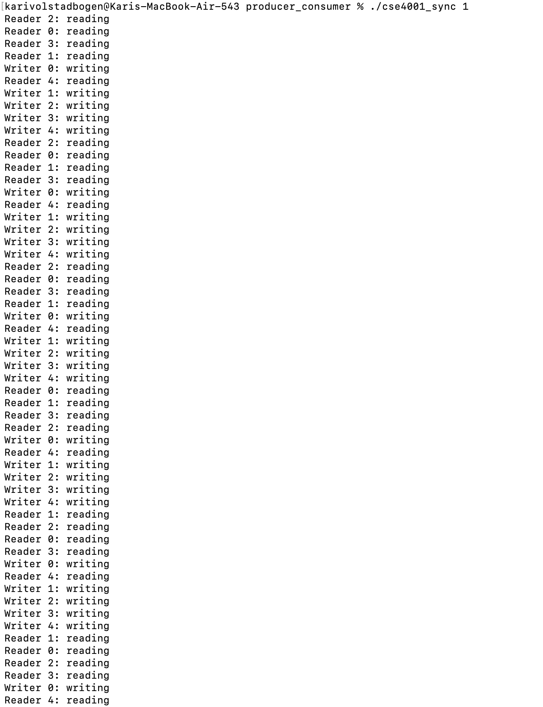

Here, multiple readers are allowed to read at the same time, but the writers need exclusive access.A combination of lightswitch and a shared turnstile semaphore is used to ensure fairness between readers and writers. Readers increment a shared counter, where the first reader acquires the room and the last reader releases it to allow multiple readers reading simultaneously. Meanwhile, the readers and writers pass through the turnstile which ensure no new readers can enter when a writer is waiting.

In this solution, the writer has priority over the readers. When a writer arrives, all new readers are blocked from starting until all the writers have finished. This system ensures that the writers are guaranteed access and does not have to starve, and the readers can operate efficiently as long as no writers are waiting.

This solution prevents deadlock by imposing an ordered hierarchy on the chopsticks. Each philosopher needs two chopsticks and needs to pick up the lower-numbered chopstick first. This implementation removes circular wait. The philosophers are alternating between eating and thinking, and this system allows for deadlocks not to happen and the dining table can progress safely.

This solution uses an asymmetric implementation where the philosophers pick up chopsticks in different orders depending on if they are even or odd numbered.Even numbered philosophers pick up their left chopstick first, and odd numbered pick up their right chopstick first. This causes asymmetry which causes the philosophers to wait on the same resource ina  circular pattern. By altering the order for half of the philosophers, the full circular dependecy causing deadlock is avoided, and the system remains safe and efficient.
